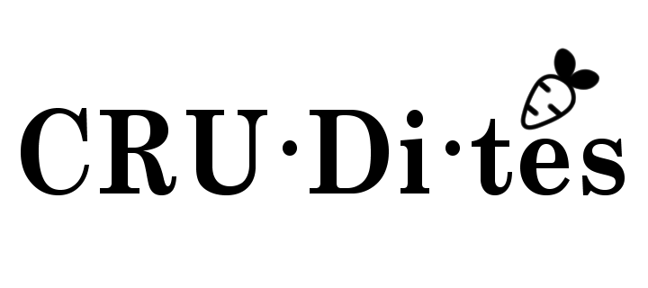
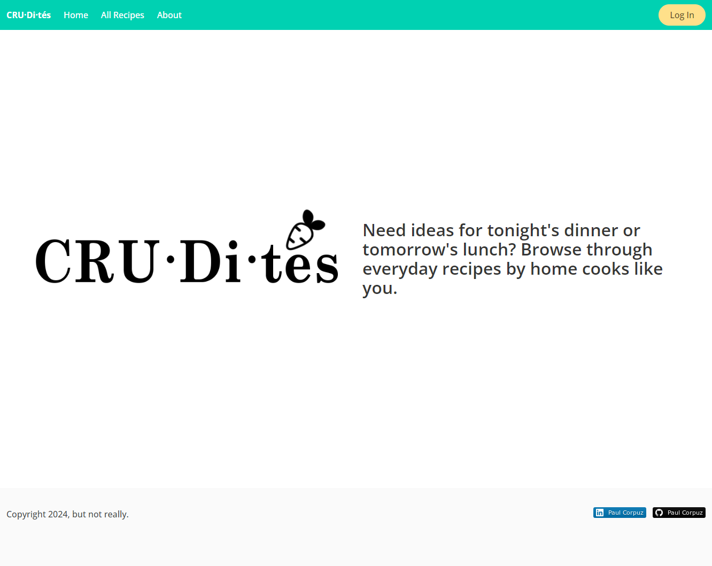

📝 CRU·Di·tés
============
As crudités are essentially a veggie platter with a fancy French name, CRU·Di·tés is a MEN-stack app with a fancy name because CRUD Platter doesn’t exactly roll off the tongue.

CRU·Di·tés was created with one focus in mind, just the recipe. Users are able to **create, read, update, and delete**  recipes to your heart's content, but descriptions and comments are restricted to 280 characters, so keep it short! Just recipes, without the crud.

### [CRU·Di·tés](https://crudites-8dba2b292faf.herokuapp.com/)

👨‍🍳 App Overview
============
'CRU·Di·tés' is developed using MongoDB, Express, and Node featuring OAuth 2.0 Authentication.

💻 Technologies Used
==============

📸 Screenshots
==============
### Wireframe

### ERD

### Mid-Development

### Deployed

🔧 Getting Started 
============
### Prerequisites
- Ensure you have a modern web browser installed on your device, such as Google Chrome, Firefox, Safari, or Edge.
- To access full CRUD capabilities, please be sure to have a google account to log in.

### Installation
No installation required, however, internet access is necessary.

⏭️ Next Steps
============
- [ ] Optimize for mobile screens.
- [ ] Update Models to include more attributes. e.g., 'Allergens', 'Cooking Equipment', etc.
- [ ] Ability to search database for recipes.
- [ ] Ability to share recipes on social media.

❤️ Acknowledgments
============
- Special thank you to [allrecipes.com ](https://www.allrecipes.com/) for the recipes.
- This app was made possible by contributions to your open-source community for the resources from viewers like you. Thank you!